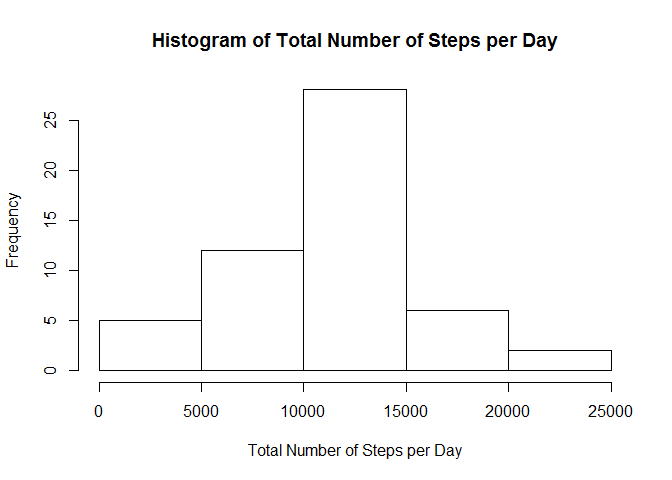
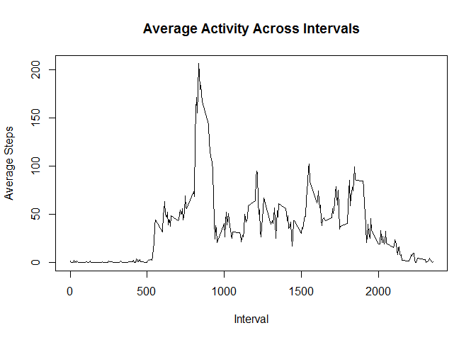
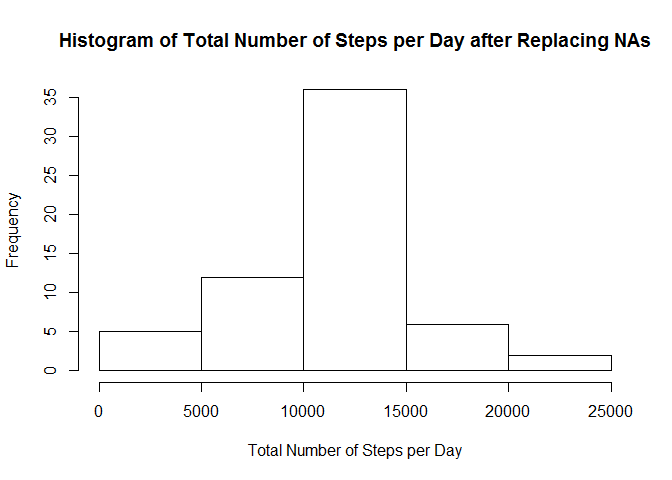
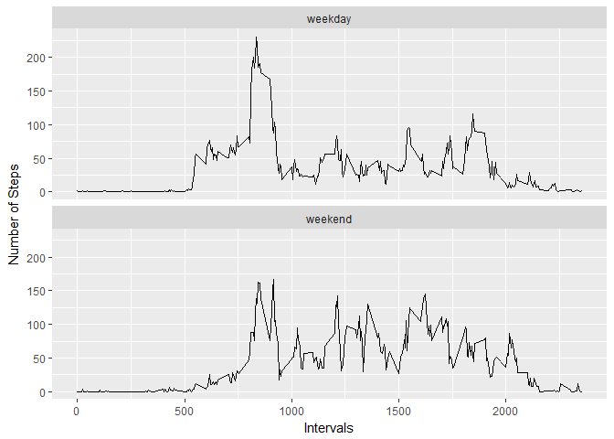

# Reproducible Research Assignment 1

## Setup Before Beginning

Before beginning with the actual processing, a few steps need to be done.

1. The dataset was downloaded from [Here.](https://d396qusza40orc.cloudfront.net/repdata%2Fdata%2Factivity.zip) *This was downloaded on 16th October, 2017. Link was provided on coursera.org from the course Reproducible Research, Week 2, Peer Review Assignment Details.*

2. Next, the directory for the session was set up


```r
setwd("~/Absolutely Non System files/rprog/4 RR Scripts")
```

3. Following that, file was unzipped and the required libraries were loaded.

```r
unzip("repdata%2Fdata%2Factivity.zip")
rm(list=ls())

library(ggplot2)
library(knitr)
library(dplyr)
```

```
## 
## Attaching package: 'dplyr'
```

```
## The following objects are masked from 'package:stats':
## 
##     filter, lag
```

```
## The following objects are masked from 'package:base':
## 
##     intersect, setdiff, setequal, union
```

The variables included in this dataset are:

1. steps: Number of steps taking in a 5-minute interval (missing values are coded as NA)
2. date: The date on which the measurement was taken in YYYY-MM-DD format
3. interval: Identifier for the 5-minute interval in which measurement was taken

The dataset is stored in a comma-separated-value (CSV) file and there are a total of 17,568 observations in this dataset.

## Loading and preprocessing the data
Show any code that is needed to

1. Load the data (i.e. read.csv())
2. Process/transform the data (if necessary) into a format suitable for your analysis

#### Load and transform data

```r
activity <- read.csv("activity.csv")
act <- activity[!is.na(activity$steps),]
```

#### Observe the data

```r
summary(act)
```

```
##      steps                date          interval     
##  Min.   :  0.00   2012-10-02:  288   Min.   :   0.0  
##  1st Qu.:  0.00   2012-10-03:  288   1st Qu.: 588.8  
##  Median :  0.00   2012-10-04:  288   Median :1177.5  
##  Mean   : 37.38   2012-10-05:  288   Mean   :1177.5  
##  3rd Qu.: 12.00   2012-10-06:  288   3rd Qu.:1766.2  
##  Max.   :806.00   2012-10-07:  288   Max.   :2355.0  
##                   (Other)   :13536
```


## What is mean total number of steps taken per day?

For this part of the assignment, you can ignore the missing values in the dataset.

1. Calculate the total number of steps taken per day
2. If you do not understand the difference between a histogram and a barplot, research the difference between them. Make a histogram of the total number of steps taken each day
3. Calculate and report the mean and median of the total number of steps taken per day

#### Calculation for daily total steps

```r
dateid <- group_by(act, date)
daily_total_steps <- summarise(dateid, sumstep=sum(steps))
```

#### Histogram

```r
hist(daily_total_steps$sumstep, main="Histogram of Total Number of Steps per Day", xlab = "Total Number of Steps per Day")
```

<!-- -->

#### Reporting the Mean and Median number of steps per day

```r
mean(daily_total_steps$sumstep)
```

```
## [1] 10766.19
```

```r
median(daily_total_steps$sumstep)
```

```
## [1] 10765
```

## What is the average daily activity pattern?

What is the average daily activity pattern?

1. Make a time series plot (i.e. type = "l") of the 5-minute interval (x-axis) and the average number of steps taken, averaged across all days (y-axis)
2. Which 5-minute interval, on average across all the days in the dataset, contains the maximum number of steps?

#### Time series plot

```r
interval_id <- group_by(act, interval)
int <- summarise(interval_id, avgstep=mean(steps))
plot(int$interval, int$avgstep, type="l", main="Average Activity Across Intervals", xlab="Interval", ylab="Average Steps")
```

<!-- -->

#### Maximum number of steps

```r
rnum <- which.max(int$avgstep)
print(paste("The interval with maximum number of steps", int[rnum,2], "is", int[rnum,1]))
```

```
## [1] "The interval with maximum number of steps 206.169811320755 is 835"
```

## Imputing missing values

Note that there are a number of days/intervals where there are missing values (coded as NA). The presence of missing days may introduce bias into some calculations or summaries of the data.

1. Calculate and report the total number of missing values in the dataset (i.e. the total number of rows with NAs)
2. Devise a strategy for filling in all of the missing values in the dataset. The strategy does not need to be sophisticated. For example, you could use the mean/median for that day, or the mean for that 5-minute interval, etc.
3. Create a new dataset that is equal to the original dataset but with the missing data filled in.
4. Make a histogram of the total number of steps taken each day and Calculate and report the mean and median total number of steps taken per day. Do these values differ from the estimates from the first part of the assignment? What is the impact of imputing missing data on the estimates of the total daily number of steps?

#### Number of missing values

```r
na_act <- activity[is.na(activity$steps),]
print(paste("Number of NAs is:", nrow(na_act)))
```

```
## [1] "Number of NAs is: 2304"
```

#### Filling strategy

```r
interval_id_na <- group_by(activity, interval)
fill_step <- summarise(interval_id_na, steps=mean(steps, na.rm=T))
```

#### Imputed data set

```r
na_act <- na_act[,2:3]
na_act <- merge(fill_step, na_act)
na_act <- na_act[,c(2,3,1)]
act_new <- rbind(act, na_act)
act_new <- act_new[order(act_new$date),]
```

#### Histogram

```r
date_id_na <- group_by(act_new, date)
daily_steps <- summarise(date_id_na, step_tot=sum(steps))
hist(daily_steps$step_tot, main="Histogram of Total Number of Steps per Day after Replacing NAs", xlab = "Total Number of Steps per Day")
```

<!-- -->

#### Reporting the mean and median number of steps per day after replacing NAs

```r
mean(daily_steps$step_tot)
```

```
## [1] 10766.19
```

```r
median(daily_steps$step_tot)
```

```
## [1] 10766.19
```

**The MEAN has not changed and the MEDIAN has increased by 1.**

**This variation is not noteworthy. No significant impact on these values has been observed.**

## Are there differences in activity patterns between weekdays and weekends?

For this part the weekdays() function may be of some help here. Use the dataset with the filled-in missing values for this part.

1. Create a new factor variable in the dataset with two levels - "weekday" and "weekend" indicating whether a given date is a weekday or weekend day.
2. Make a panel plot containing a time series plot (i.e. type = "l") of the 5-minute interval (x-axis) and the average number of steps taken, averaged across all weekday days or weekend days (y-axis). See the README file in the GitHub repository to see an example of what this plot should look like using simulated data.

#### Creating factor variable for indicating weekday or weekend

```r
act_new$day_type <- weekdays(as.Date(act_new[,2]))
act_new$day_type[act_new$day_type %in% c("Saturday","Sunday")] <- "weekend"
act_new$day_type[act_new$day_type != "weekend"] <- "weekday"
act_new$day_type <- as.factor(act_new$day_type)
```

#### Panel Plot

```r
act_new_by_day <- aggregate(steps ~ interval + day_type, act_new, mean)
qplot(x=interval, y=steps, data=act_new_by_day, geom="line", xlab="Intervals", ylab="Number of Steps") + facet_wrap(~day_type, ncol=1)
```

<!-- -->
